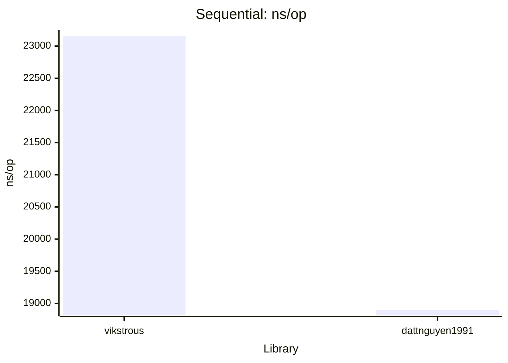
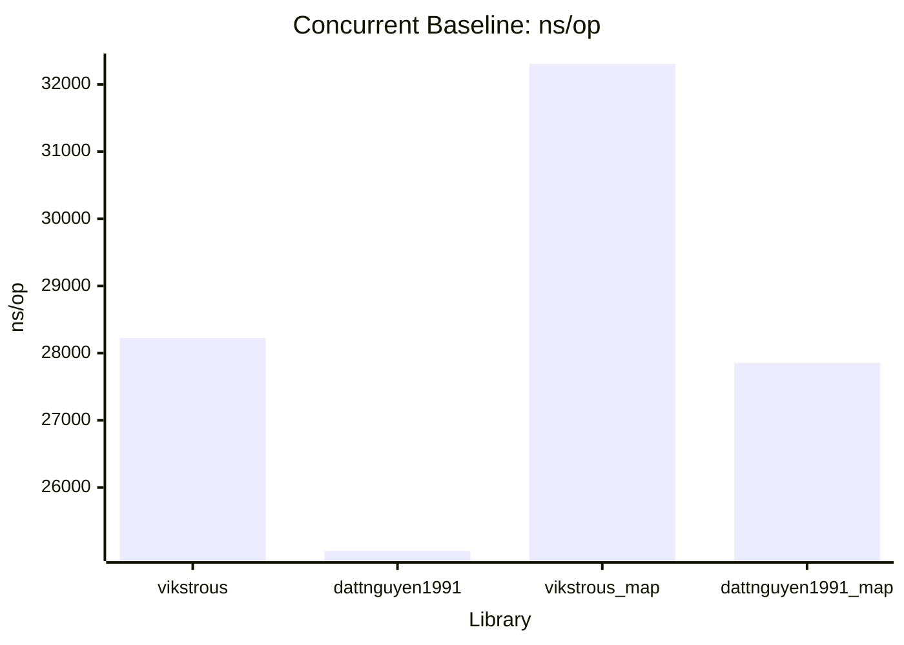
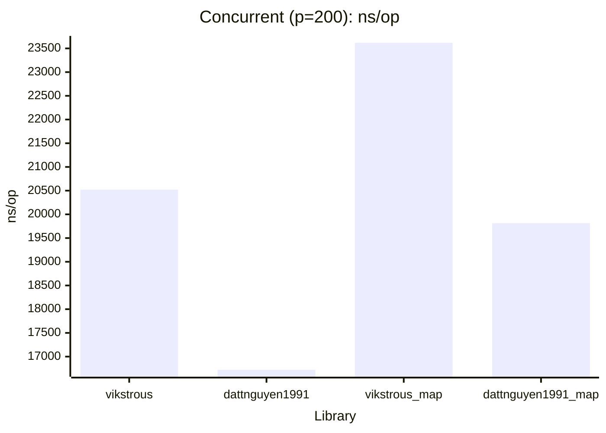

# Cross benchmark Comparison:

This summary visualizes and compares the performance of two Go dataloaders libraries (`vikstrous` and `dattnguyen1991`) based on the latest results in `benchmark-results.txt`.

## 1. Sequential Benchmark

| Library         | ns/op   | B/op   | allocs/op |
|-----------------|---------|--------|-----------|
| vikstrous       | 23,159  | 11,038 | 218       |
| dattnguyen1991  | 18,897  | 10,505 | 210       |

## 2. Concurrent Baseline

| Library         | ns/op   | B/op   | allocs/op |
|-----------------|---------|--------|-----------|
| vikstrous       | 28,226  | 12,688 | 318       |
| dattnguyen1991  | 25,056  | 12,159 | 311       |
| vikstrous_map   | 32,308  | 22,503 | 327       |
| dattnguyen1991_map | 27,857 | 22,068 | 320     |

## 3. Concurrent (parallelism=200)

| Library         | ns/op   | B/op   | allocs/op |
|-----------------|---------|--------|-----------|
| vikstrous       | 20,521  | 12,669 | 318       |
| dattnguyen1991  | 16,721  | 12,113 | 310       |
| vikstrous_map   | 23,618  | 22,445 | 327       |
| dattnguyen1991_map | 19,814 | 22,007 | 320     |

### Key Insights
- `dattnguyen1991` is consistently faster and uses less memory and allocations than `vikstrous` in all scenarios.
- The performance gap widens in concurrent and mapFetch scenarios.
- Both libraries see increased allocations and memory usage in mapFetch and high parallelism.

---

*Data source: [cross_benchmark/benchmark-results.txt](cross_benchmark/benchmark-results.txt)*

